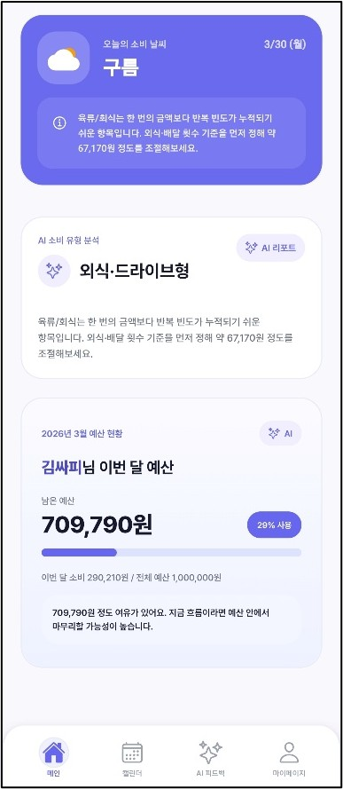
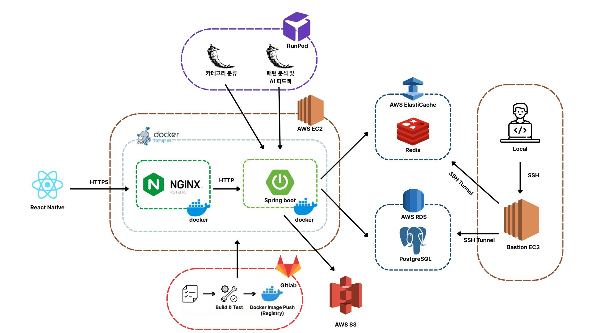

# 🌤️ WOW
> **날씨로 소비 절약을 만드는, WOW**

| 항목 | 내용 |
|------|------|
| 서비스명 | WOW |
| 개발 기간 | 2026.01 ~ 2026.02 |
| 개발 인원 | 6명 (FE 2, BE 3) |

 

## 목차
- [💡 기획 배경](#-기획-배경)
- [✨ 서비스 주요 기능](#-서비스-주요-기능)
- [📱 주요 화면 및 기능 소개](#-주요-화면-및-기능-소개)
- [🏗️ 시스템 아키텍처](#️-시스템-아키텍처)
- [👥 팀원 소개](#-팀원-소개)
- [⚙️ 기술 스택](#️-기술-스택)

 

## 💡 기획 배경

### 날씨로 소비 절약을 만드는, WOW

우리는 매달 카드값이 나올 때마다 어디서 얼마를 썼는지 파악하기 어려워 당황한 경험이 있습니다. 이러한 문제는 다음과 같은 이유에서 비롯됩니다.

- 내가 어떤 유형을 가지고 소비하는지 스스로 인식하지 못합니다.
- 흩어진 소비 내역을 한눈에 파악하기 어렵습니다.

이처럼 소비를 효율적으로 관리하지 못해 발생하는 고민을 해결하고자, 우리는 다음과 같은 목표를 바탕으로 앱 개발을 진행하였습니다.

- 계좌/카드 내역을 자동으로 파싱하여 소비 내역을 한눈에 제공합니다.
- GMM을 활용한 소비 유형 제공과 카테고리 사용금액 분석을 제공합니다.
- 분석된 데이터를 Qwen2.5 AI를 활용하여 소비 패턴을 분석하고 날씨로 표현하며, 카테고리별 절약 금액과 행동 방향을 제시합니다.
- 고정지출을 등록하여 매달 예정된 지출을 미리 파악하고 알림을 보내줍니다.

 

## ✨ 서비스 주요 기능

### 📅 캘린더 기반 소비 관리
- 월별 캘린더에서 날짜별 소비 내역 및 소비 상태(날씨) 한눈에 확인
- 일별 거래내역 상세 조회 및 메모 기능 제공
- 이번 달 절약 금액 및 목표 달성 현황 실시간 확인
- 과거 / 현재 / 미래 소비 흐름을 직관적으로 파악

### 💳 거래내역 관리 및 자동 분류
- 은행/카드 엑셀 파일 업로드 시 거래내역 자동 파싱
- AI 기반 카테고리 자동 분류 (GMM 모델 활용)
- 미분류 항목 수동 재분류 지원
- 거래내역 직접 입력 기능 제공
- 월별 거래내역 날짜별 그룹 조회 및 총 지출/수입 확인
- 고정지출 항목 📌 핀 표시로 직관적 구분

### 📌 고정지출 관리
- 거래내역 기반 고정지출 자동 등록
- 매월 납부일 설정 및 주말 → 평일 자동 이월 처리
- 납부완료 / D-N 상태 자동 계산
- 활성화 / 비활성화 토글로 유연한 관리
- 납부일 알림 제공

### 🤖 AI 소비 분석 및 피드백 *(핵심 기능)*
> GMM + Qwen2.5 기반 개인화 소비 분석 시스템

**📊 소비 분석**
- 3개월 거래 데이터를 기반으로 소비 유형 자동 분류 (GMM)
- 카테고리별 소비 비중 및 전월 대비 변화 분석
- 과소비 항목 및 소비 패턴 도출

**🌤 소비 날씨 시각화**
- 소비 상태를 날씨 형태로 직관적으로 표현
- 오늘의 소비 상태 및 AI 코멘트 제공
- 과거 / 현재 / 미래 소비 예측 제공

**💡 AI 맞춤 피드백**
- 절약 가능 금액 및 조정 후 예상 지출 제안
- 가장 효과적인 절약 항목 1가지 추천
- 절약 우선순위 (비중 기반) 제공
- 주요 소비 카테고리 분석
- 카테고리별 실행 가능한 AI 절약 팁 3가지 제공

 

## 📱 주요 화면 및 기능 소개

### 1. 메인페이지

  
  
  

- 상단에서는 소비에 따른 날씨 이모지를 확인할 수 있습니다.
- 중단에서는 소비 유형 분석결과와 본인이 소속된 분류를 확인할 수 있습니다.
- 하단에서는 이번달의 예산에 따른 지출정도와, 지난달과의 비교 그래프를 확인할 수 있습니다.

### 2. 캘린더

  
  
  
  

- 오늘의 소비 날씨와 함께 한달동안의 지출과 이에 따른 날씨 이모지를 확인하고, 메모할 수 있습니다.
- 내역추가를 통해 직접 카테고리를 지정하여 수기작성하거나, 엑셀파일과 AI를 통한 자동분류 서비스를 제공받을 수 있습니다.
- 기록된 소비 내역들 중 고정적인 지출이 존재한다면, 사용자는 하단의 고정지출등록 기능을 사용하여 날짜를 지정하고 고정지출로 분류가 됩니다.

### 3. AI 피드백

  
  
  

- 한달에 한번, 사용자는 소비 내역을 AI를 통해 분석하고, 소비분석과 앞으로의 소비방향성에 대한 피드백을 받을 수 있습니다.
- 소비 내역분석이 완료되면 사용자는 소비 특성에 따른 8가지의 분류들 중 하나에 소속되며, 이는 메인페이지의 소비 유형 분석에서 확인할 수 있습니다.
- 한번 분석이 끝난 사용자 분석은 리포트 형태로써, 다음 분석 기회가 오기 전까지 다시 보기를 통해 언제든지 재확인 할 수 있습니다.

 

## 🏗️ 시스템 아키텍처

 

## 👥 팀원 소개

<table>
  <!-- Frontend -->
  <tr>
    <td align="center">
      
    </td>
    <td align="center">
      
    </td>
    <td align="center">
      
    </td>
  </tr>

  <tr>
    <td align="center">
      <a href="https://github.com/FE아이디1">
         
        <b>진윤세</b>
      </a>
    </td>
    <td align="center">
      <a href="https://github.com/FE아이디2">
         
        <b>오우택</b>
      </a>
    </td>
    <td align="center">
      <a href="https://github.com/FE아이디3">
         
        <b>최인호</b>
      </a>
    </td>
  </tr>

  <!-- Backend -->
  <tr>
    <td align="center">
      
    </td>
    <td align="center">
      
    </td>
    <td align="center">
      
    </td>
  </tr>

  <tr>
    <td align="center">
      <a href="https://github.com/Son-juyeong">
         
        <b>손주영</b>
      </a>
    </td>
    <td align="center">
      <a href="https://github.com/basicprogram">
         
        <b>오우택</b>
      </a>
    </td>
    <td align="center">
      <a href="https://github.com/K-JW">
         
        <b>김진우</b>
      </a>
    </td>
  </tr>
</table>

## ⚙️ 기술 스택

### Frontend

### Backend

### AI

### Infra

-4169E1?style=for-the-badge&logo=postgresql&logoColor=white)
-DC382D?style=for-the-badge&logo=redis&logoColor=white)

